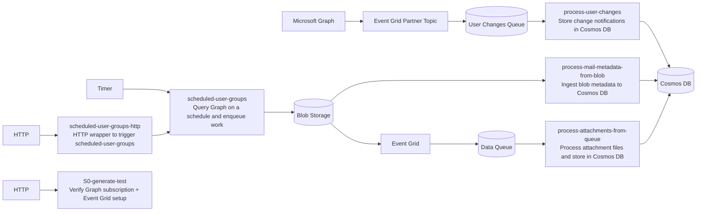

# fun-with-function
Microsoft Graph + Azure Integration Services (PowerShell)


# Installation and usage
- install AZ CLI, e.g. in Windows: `winget install --exact --id Microsoft.AzureCLI`
- ./provision.ps1 <name-prefix> <resource-group>
- Install-Module PowerShellGet -Scope CurrentUser -Force -AllowClobber
  
## Overview (ideas)
- Graph change notifications → Event Grid Partner Topic → Storage Queue → Cosmos DB
- Scheduled Graph queries → Blob Storage → Functions → Cosmos DB
- Event Grid (blob events) → Queue → Function → Cosmos DB

## Visual overview


## Folders (what they do)
- [S0-generate-test](S0-generate-test): verify setup HTTP function
- [process-user-changes](process-user-changes): Graph change notifications → Cosmos
- [process-mail-metadata-from-blob](process-mail-metadata-from-blob): blob metadata → Cosmos
- [process-attachments-from-queue](process-attachments-from-queue): data file events → Cosmos
- [scheduled-user-groups](scheduled-user-groups): scheduled Graph queries → queue
- [scheduled-user-groups-http](scheduled-user-groups-http): HTTP wrapper for scheduled-user-groups
- [shared/graph-subscription.ps1](shared/graph-subscription.ps1): Graph + Event Grid setup helper
- [infra/app.bicep](infra/app.bicep): infra and app settings

## Graph change notifications (PowerShell setup)
Use [setup.ps1](setup.ps1). It wires up:
- Graph app settings
- Partner topic activation
- Event subscription to queue

Steps:
1) Deploy shared RG resources (once per RG)
```
./setup.ps1 -Prefix <name-prefix> -ResourceGroup <resource-group> -DeploySharedResources
```

2) Deploy the app
```
./setup.ps1 -Prefix <name-prefix> -ResourceGroup <resource-group>
```

3) Verify setup (HTTP)
```
curl https://<app>.azurewebsites.net/api/test/generate/verify
```

What it checks:
- Graph subscription (id, expiration, notificationUrl)
- Partner topic state
- Partner event subscription state

See:
- [S0-generate-test/run.ps1](S0-generate-test/run.ps1)
- [shared/graph-subscription.ps1](shared/graph-subscription.ps1)
- [infra/app.bicep](infra/app.bicep)

## Local dev (short)
1) Start Azurite
```
npx azurite --location ./azurite --silent
```

2) local.settings.json
```
{
  "IsEncrypted": false,
  "Values": {
    "AzureWebJobsStorage": "UseDevelopmentStorage=true",
    "FUNCTIONS_WORKER_RUNTIME": "powershell"
  }
}
```

3) Run
```
func start --script-root .
```

## Reference docs
- [docs/graph-change-notifications.md](docs/graph-change-notifications.md)
