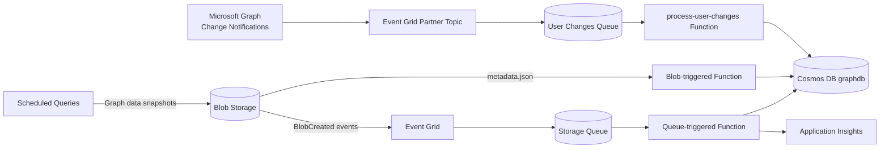

# fun-with-function
Microsoft Graph + Azure Integration Services Showcase

# Installation and usage
- install AZ CLI, e.g. in Windows: `winget install --exact --id Microsoft.AzureCLI`
- ./provision.ps1 <name-prefix> <resource-group>
- Install-Module PowerShellGet -Scope CurrentUser -Force -AllowClobber

## Architecture overview
- Microsoft Graph change notifications (users/groups/permissions) are sent to an Event Grid Partner Topic.
- Event Grid Partner Topic routes change notifications to Storage Queues for decoupled processing.
- Queue-triggered Functions (Flex Consumption, PowerShell 7.4) process Graph events and store snapshots in Cosmos DB.
- Scheduled queries capture periodic Graph data snapshots and store them as JSON blobs.
- Blob-triggered Functions process snapshot data and write enriched records to Cosmos DB (pk = userId `/pk`).
- Event Grid subscription (Managed Identity delivery) sends BlobCreated events to Storage Queues for decoupled processing.
- Single User-Assigned Managed Identity (UAMI) applied to Function App, used for Event Grid delivery; data-plane access uses MI (roles: Storage Blob Data Contributor + Queue Data Contributor, Cosmos DB Data Contributor as needed).
- Application Insights enabled for the Function App.
- Graph subscription lifecycle management (creation/renewal) handled automatically via `profile.ps1` and `process-user-changes`.

### Message flow
```
Microsoft Graph Change Notifications --> Event Grid Partner Topic --> Storage Queue --> process-user-changes Function --> Cosmos DB
Scheduled Graph Queries --> Blob Storage (graphsnapshots/{snapshotId}/metadata.json + data files)
		metadata.json --> Blob Trigger Function --> Cosmos DB
		data files --> Event Grid (MI delivery) --> Storage Queue --> Data processor Function --> Cosmos DB
```

### Visual overview (Mermaid)


### Function folders
- `S0-generate-test`: HTTP trigger to generate test Graph snapshot data (metadata.json + data files) and simulate Graph change events.
- `process-attachments-from-queue`: Queue trigger to process Graph data file events and write Cosmos DB records.
- `process-mail-metadata-from-blob`: Blob trigger to read Graph snapshot metadata.json and write Cosmos DB records.
- `process-user-changes`: Queue trigger to process Microsoft Graph change notifications from Event Grid Partner Topic.

## Run locally
### Prerequisites
- Azure Functions Core Tools v4
- PowerShell 7.x (tested with 7.4)
- Node.js 18+ (for Azurite)
- Azurite (local Storage emulator)

### 1) Start Azurite (Storage emulator)
Run this from the repo root:

```
npx azurite --location ./azurite --silent
```

### 2) Create local settings
Create a file at ./local.settings.json:

```json
{
	"IsEncrypted": false,
	"Values": {
		"AzureWebJobsStorage": "UseDevelopmentStorage=true",
		"FUNCTIONS_WORKER_RUNTIME": "powershell",
		"DISABLE_COSMOS_OUTPUT": "true",
		"GRAPH_USER_CHANGES_QUEUE_NAME": "graph-user-changes-q"
	}
}
```

> Set `DISABLE_COSMOS_OUTPUT=false` and provide a real `CosmosDBConnection` value if you want to write to Cosmos DB locally or in Azure.

### 3) Start Functions
From the repo root:

```
func start --script-root .
```

### 4) Generate a test payload
```
curl http://localhost:7071/api/test/generate/test-123
```

This writes:
- Blob: `graphsnapshots/metadata/test-123/metadata.json`
- Blob: `graphsnapshots/attachments/test-123/fake.txt`
- Queue message: `graph-attachments-q`

### Notes
- The Functions runtime will usually auto-create the `graphsnapshots` container and `graph-attachments-q` queue when using Azurite. If it doesn't, create them manually via Azure Storage Explorer or the Azurite API.

## Provision Azure resources
Use the provisioning script (managed identity, Flex Consumption, Storage + Cosmos DB):

```
./provision.ps1 <name-prefix> <resource-group>
```

### Resource-group shared setup (once per RG)
Deploy the shared resources (partner configuration) once per resource group:

```
./setup.ps1 -Prefix <name-prefix> -ResourceGroup <resource-group> -DeploySharedResources
```

### Function app setup (per app)
Deploy the app-specific resources per function app:

```
./setup.ps1 -Prefix <name-prefix> -ResourceGroup <resource-group>
```

## Microsoft Graph change notifications
See [docs/graph-change-notifications.md](docs/graph-change-notifications.md) for the deep-dive on Graph subscriptions, Event Grid partner topics, and deployment options.

## Testing (end-to-end)
1. Trigger a test Graph event via S0-generate-test endpoint; generates test Graph snapshot data.
2. Confirm blob path `graphsnapshots/metadata/{snapshotId}/metadata.json`.
3. Verify data file events arrive in `graph-attachments-q`.
4. Check blob-trigger Function invocation; confirm Cosmos DB `graphsnapshots` container has document with `pk=userId` and `snapshotId`.
5. Verify Microsoft Graph change notifications are received in `graph-user-changes-q` and processed by `process-user-changes`.
6. Inspect Application Insights traces for the snapshotId or Graph event data.
