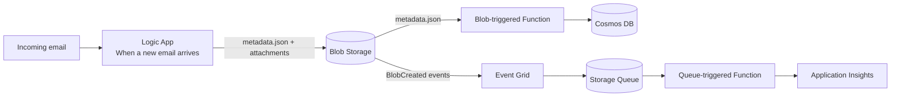

# fun-with-function
Example on how to use the Azure Integration Services

## Architecture overview
- Logic App (Consumption) ingests emails, writes metadata + attachments to Blob Storage under `emails/{correlationId}/`.
- Blob-triggered Function (Flex Consumption, PowerShell 7.4) fires only for `emails/{correlationId}/metadata.json` and writes Cosmos DB docs (pk = sender email `/pk`).
- Event Grid subscription (Managed Identity delivery) sends attachment BlobCreated events to a Storage Queue for decoupled attachment handling.
- Attachment queue processor (PowerShell) logs/handles attachment events and writes a Cosmos DB record.
- Single User-Assigned Managed Identity (UAMI) applied to Function App, used for Event Grid delivery, and enabled on Logic App; data-plane access uses MI (roles: Storage Blob Data Contributor + Queue Data Contributor, Cosmos DB Data Contributor as needed).
- Application Insights enabled for the Function App.

### Message flow
```
Email --> Logic App --> Blob Storage (metadata.json + attachments)
		metadata.json --> Blob Trigger Function -> Cosmos DB
		attachments/* --> Event Grid (MI delivery) -> Storage Queue -> Attachment handler
```

### Visual overview (Mermaid)


### Function folders
- `S0-generate-test`: HTTP trigger to generate test metadata + attachment blobs and enqueue a BlobCreated CloudEvent.
- `S1-process-attachments`: Queue trigger to process attachment events and write a Cosmos DB record.
- `S2-mail-metadata-from-blob`: Blob trigger to read metadata.json and write a Cosmos DB record.

## Run locally
### Prerequisites
- Azure Functions Core Tools v4
- PowerShell 7.x (tested with 7.4)
- Node.js 18+ (for Azurite)
- Azurite (local Storage emulator)

### 1) Start Azurite (Storage emulator)
Run this from the repo root:

```
npx azurite --location ./azurite --silent
```

### 2) Create local settings
Create a file at ./local.settings.json:

```json
{
	"IsEncrypted": false,
	"Values": {
		"AzureWebJobsStorage": "UseDevelopmentStorage=true",
		"FUNCTIONS_WORKER_RUNTIME": "powershell",
		"DISABLE_COSMOS_OUTPUT": "true"
	}
}
```

> Set `DISABLE_COSMOS_OUTPUT=false` and provide a real `CosmosDBConnection` value if you want to write to Cosmos DB locally or in Azure.

### 3) Start Functions
From the repo root:

```
func start --script-root .
```

### 4) Generate a test payload
```
curl http://localhost:7071/api/test/generate/test-123
```

This writes:
- Blob: `emails/test-123/metadata.json`
- Blob: `emails/test-123/attachments/fake.txt`
- Queue message: `hr-attachments-q`

### Notes
- The Functions runtime will usually auto-create the `emails` container and `hr-attachments-q` queue when using Azurite. If it doesn’t, create them manually via Azure Storage Explorer or the Azurite API.

## Provision Azure resources
Use the provisioning script (managed identity, Flex Consumption, Storage + Cosmos DB):

```
./provision.ps1 <name-prefix> <resource-group>
```

## Testing (end-to-end)
1. Send a test email; Logic App writes metadata.json + attachments.
2. Confirm blob path `emails/{correlationId}/metadata.json`.
3. Verify attachment events arrive in `hr-attachments-q`.
4. Check blob-trigger Function invocation; confirm Cosmos DB `emails` container has document with `pk=fromEmail` and `correlationId`.
5. Inspect Application Insights traces for the correlationId.
