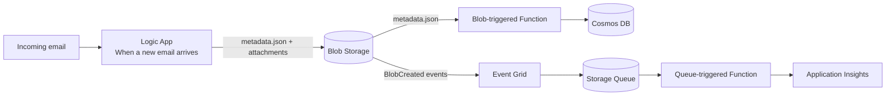
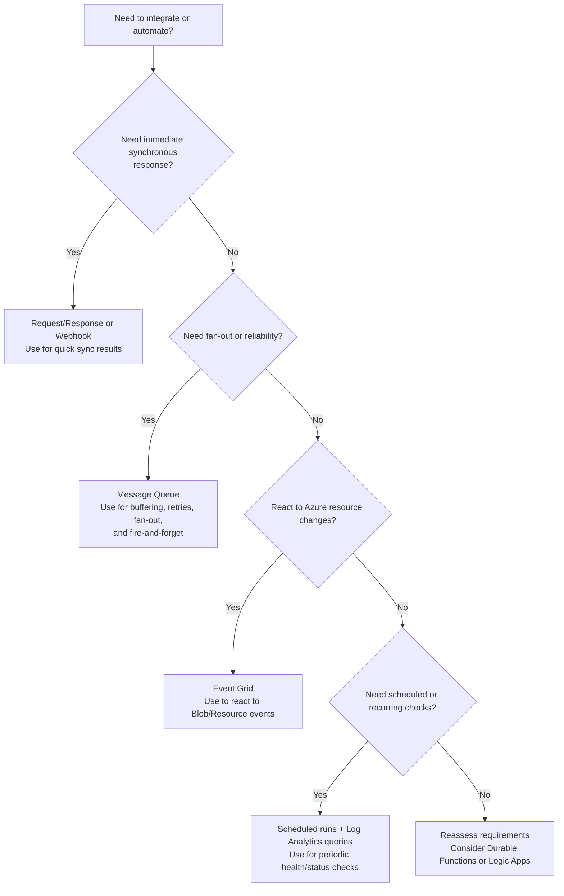

## Architecture overview
- Logic App (Consumption) ingests emails, writes metadata + attachments to Blob Storage under `emails/{correlationId}/`
- Blob-triggered Function (Flex Consumption, PowerShell 7.4) fires only for `emails/{correlationId}/metadata.json` and writes Cosmos DB docs (pk = sender email `/pk`)
- Event Grid subscription (Managed Identity delivery) sends attachment BlobCreated events to a Storage Queue for decoupled attachment handling
- Attachment queue processor (PowerShell) logs/handles attachment events
- Single User-Assigned Managed Identity (UAMI) applied to Function App, used for Event Grid delivery, and enabled on Logic App; data-plane access uses MI (roles: Storage Blob Data Contributor + Queue Data Contributor, Cosmos DB Data Contributor as needed)
- Application Insights enabled for the Function App

### Message flow
```
Email --> Logic App --> Blob Storage (metadata.json + attachments)
        metadata.json --> Blob Trigger Function -> Cosmos DB
        attachments/* --> Event Grid (MI delivery) -> Storage Queue -> Attachment handler
```

## Visual overview (Mermaid)


## Integration pattern chooser (Mermaid)


## Zero-to-hero guide
This repo models an **Azure Integration Services** pattern that uses Logic Apps for orchestration, Functions for compute, and Event Grid + Storage Queues for reliable fan-out. The goal is to keep **ingestion**, **processing**, and **state** separated so each piece can scale and evolve independently.

### 1) What problem are we solving?
You want an email ingestion pipeline that:
- Handles attachments safely and asynchronously.
- Persists key metadata for audit/search.
- Doesn’t block on long-running work.

### 2) The moving parts (what each service is best at)
- **Logic App**: orchestration and connectors (e.g., Outlook). It’s your “integration glue”.
- **Blob Storage**: a durable, cheap landing zone for payloads.
- **Event Grid**: pushes events when blobs are created (no polling).
- **Storage Queue**: buffers work and decouples consumers.
- **Azure Functions**: serverless compute for processing, enrichment, and routing.
- **Cosmos DB**: stores the state or “source of truth” for tracking status.

### 3) “Hello world” flow in this repo
1. **Email arrives** (Logic App trigger).
2. **Logic App writes** `metadata.json` + attachments to `emails/{correlationId}/`.
3. **Blob-triggered Function** fires on `metadata.json` only and writes a Cosmos DB document.
4. **Event Grid** sends `BlobCreated` events (attachments only) to a Storage Queue.
5. **Queue-triggered Function** processes attachments asynchronously.

### 4) Why this is a solid baseline pattern
- **Backpressure**: the queue buffers spikes.
- **Separation of concerns**: Logic App does integration, Functions do compute.
- **Observability**: correlation ID flows through storage, Cosmos, and logs.
- **Security**: Managed Identity eliminates shared secrets.

## Use cases and patterns (when to use what)
### Pattern 1: Simple fan-out after ingest (this repo)
**Use when** you want to store the original payload and process sub-items independently.
- Example: email ingestion with multiple attachments.
- Pattern: Logic App → Blob → Event Grid → Queue → Functions.

### Pattern 2: Durable orchestration (long-running workflows)
**Use when** your workflow needs retries, timers, or human steps.
- Example: onboarding/offboarding with approvals, multi-step tasks.
- Pattern: Logic App (standard or consumption) or Durable Functions orchestrator.

### Pattern 3: Event-driven micro-pipelines
**Use when** you need multiple downstream systems to act on the same event.
- Example: send a notification, update search index, archive to cold storage.
- Pattern: Event Grid → multiple subscriptions or queues.

### Pattern 4: Scheduled analytics checks
**Use when** you need periodic evaluations that don’t depend on a single event.
- Example: daily compliance checks using Log Analytics queries.
- Pattern: Scheduled trigger → Log Analytics query → Function/Logic App actions.

## Local run with Azurite (dev/test)
Use Azurite for local Storage emulation and the `generate-test` function to create sample blobs/queue messages.

1. Start Azurite:
   - `npx azurite --location ./azurite --silent`
2. Configure `local.settings.json` (example for PowerShell):
   ```json
   {
     "IsEncrypted": false,
     "Values": {
       "AzureWebJobsStorage": "UseDevelopmentStorage=true",
       "FUNCTIONS_WORKER_RUNTIME": "powershell"
     }
   }
3. Start Functions locally:
   - `func start --script-root FunctionApp`
4. Generate a test payload:
   - `curl http://localhost:7071/api/test/generate/test-123`

This will write `emails/test-123/metadata.json`, `emails/test-123/attachments/fake.txt`, and enqueue a message to `hr-attachments-q`.

> Note: Ensure the `emails` blob container and `hr-attachments-q` queue exist in your Azurite storage account before running the `generate-test` function, or verify that your Functions runtime is configured to auto-create them. If Azurite or your bindings do not support auto-creation, create these resources manually (for example, using Azure Storage Explorer or the Azurite REST API/SDKs).
## Use case: mail attachment processing (repo example)
**Flow recap**
- Logic App writes `metadata.json` + attachments to blob.
- Blob-triggered Function writes a Cosmos DB record for tracking.
- Event Grid pushes attachment events to a queue.
- Queue-triggered Function processes attachments independently.

**Why this works**
- Attachment work is isolated and can scale horizontally.
- Metadata is processed once (no double-processing attachments).
- Cosmos DB becomes your searchable index.

## Use case: user offboarding (design-only)
**Goal**: reliably delete user access/data across systems and track progress.

### Recommended approach (fan-out + status tracking)
1. **Logic App** receives “user offboarding” event (HR system, ServiceNow, etc.).
2. **Logic App** writes a master document to **Cosmos DB** with status `Pending` and a `correlationId`.
3. **Logic App** publishes a message to a **queue** (or **Service Bus topic**) representing the offboarding request.
4. **Function** reads the request and **fans out** tasks into specific queues (e.g., `disable-ad`, `revoke-saas`, `archive-mailbox`).
5. Each task Function updates Cosmos DB for its own step (e.g., `Completed`, `Failed`, `NeedsRetry`).
6. A **status endpoint** or dashboard reads Cosmos DB to show progress per user.

### When to prefer Service Bus over Storage Queues
- You need **topics & subscriptions**, ordering, or dead-lettering.
- You want **session-based** processing per user.
- You need **peek-lock** processing and richer retry/dead-letter controls.

### Alternative idea: Durable Functions
If you want orchestration logic centralized and stateful, a **Durable Functions orchestrator** can coordinate all tasks and maintain state. This reduces “glue code” but increases coupling to Functions. A hybrid is common: a Durable orchestrator for tracking, Service Bus for execution.

## Long-running tasks with regular checks
### Option A: Durable Functions (recommended)
- Use **Durable Timers** to schedule periodic checks.
- Maintain workflow state automatically.
- Built-in retries and timeouts.

### Option B: “Heartbeat” queues
- A Function enqueues a follow-up message after each step.
- The next worker performs the periodic check and re-enqueues if needed.
- Store progress in Cosmos DB.

### Option C: Logic App with recurrence + state
- Use a Logic App recurrence trigger to poll status.
- Good for low/medium volume and easy visual operations.

**Rule of thumb**
- Use **Durable Functions** when you need **long-running stateful orchestration**.
- Use **queues + Cosmos DB** for simple, decoupled workflows.
- Use **Logic Apps** when connectors and visual ops are the primary value.

## Service Bus vs Storage Queues (what changes)
- **Service Bus** adds topics/subscriptions, sessions, ordering, dead-letter queues, and peek-lock processing.
- **Storage Queues** are simpler and cheaper for basic buffering and fan-out, but lack advanced routing features.
- If you need per-user sequencing or complex retries, choose **Service Bus** and use sessions or DLQs.

## Where API Management fits
API Management (APIM) can sit in front of Functions or Logic Apps to:
- Apply authentication/authorization consistently.
- Enforce rate limits, quotas, and IP filtering.
- Provide request/response transformations, caching, and versioning.
- Offer developer portals and API documentation for internal/external consumers.

## Other Azure integration services to consider
- **Event Hubs** for high-throughput streaming ingestion.
- **Data Factory** for batch data movement and ETL.
- **Azure Data Explorer** for log/telemetry analytics at scale.
- **Logic Apps (Standard)** for stateful workflows in a single app runtime.
- **Durable Functions** for long-running stateful orchestration when code-first is preferred.

## Notable Blob Storage features
- **Blob Inventory**: scheduled reports of blob metadata for auditing or analytics.
- **Lifecycle Management**: auto-tier or delete blobs based on rules (age, access pattern).
- **Immutability (WORM)**: time-based retention or legal hold for compliance.
- **Versioning & Soft Delete**: recover deleted/overwritten blobs.

## Iterative Portal To-Do
1. Create/choose Resource Group and Storage Account; add blob container `emails`
2. Create UAMI; grant Storage Blob Data Reader/Contributor (as needed) and Cosmos DB Data Contributor
3. Create Logic App (Consumption); enable user-assigned MI; add Outlook "When a new email arrives (V3)" trigger; build `correlationId` (GUID); write metadata.json + attachments to `emails/{correlationId}/...` using MI auth to Storage
4. Create Storage Queue `hr-attachments-q`
5. Create Event Grid subscription on the Storage Account for attachments:
   - Event type: BlobCreated
   - Endpoint: Storage Queue `hr-attachments-q`
   - Filters: subject begins `/blobServices/default/containers/emails/blobs/emails/` and ends `/attachments/`
   - Delivery identity: use the UAMI
6. Create Function App (Flex Consumption, Linux, PowerShell 7.4) with Application Insights; assign the UAMI
7. Deploy functions:
   - `process-queue` (blob trigger on `emails/{correlationId}/metadata.json`) upserts into Cosmos DB
   - `process-attachments` (queue trigger for `hr-attachments-q`) logs/handles attachments
8. Create Cosmos DB account (SQL API), database `hrdb`, container `emails`, partition key `/pk`
9. Test end-to-end with sample email; verify Cosmos DB document and logs

## Minimal Function Code (PowerShell 7.4)
- Files: `FunctionApp/process-queue/run.ps1`, `FunctionApp/process-queue/function.json` (blob trigger), `FunctionApp/process-attachments/*`
- Config: `host.json` with extension bundle; modules downloaded locally via `fetch-modules.ps1`

## Azure CLI provisioning (script below)

## Testing
1. Send a test email; Logic App writes metadata.json + attachments
2. Confirm blob path `emails/{correlationId}/metadata.json`
3. Verify attachment events arrive in `hr-attachments-q`
4. Check blob-trigger Function invocation; confirm Cosmos DB `emails` container has document with `pk=fromEmail` and `correlationId`
5. Inspect Application Insights traces for correlationId
