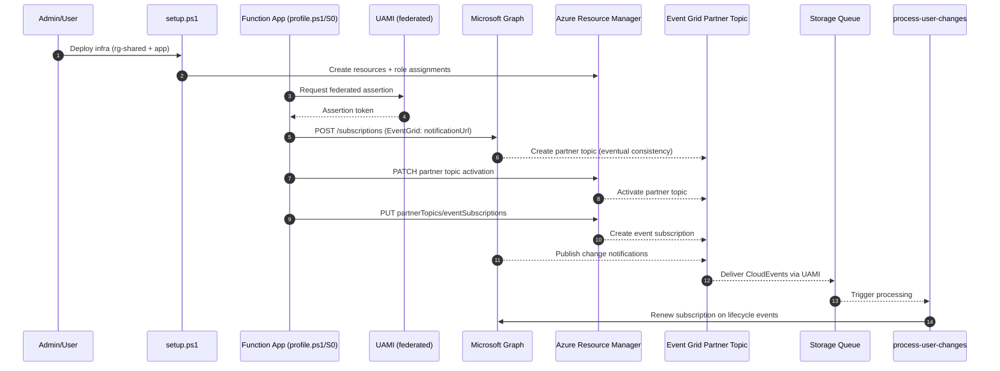

# Graph change notification → Event Grid flow

## Notes
- The partner topic is created by Microsoft Graph when the subscription uses the EventGrid notification URL.
- Partner topic creation is eventually consistent; retries may be needed before activation/subscription succeed.
- The Function App uses a managed identity to call Graph and ARM.
